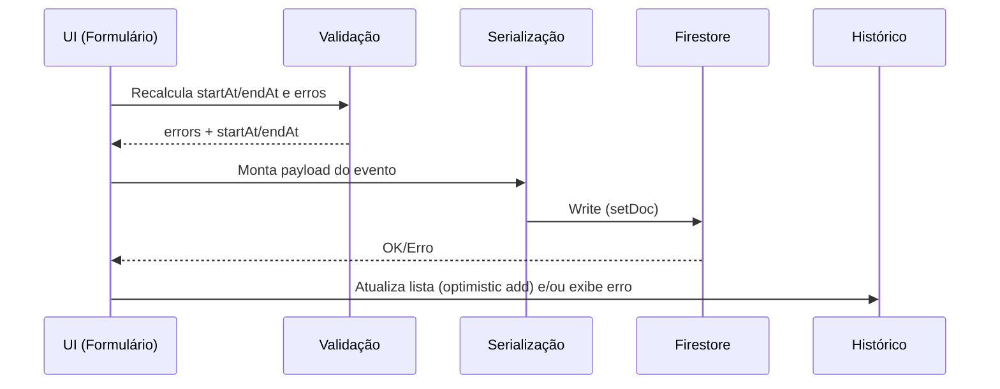

## Visão do produto e objetivo operacional

O produto é um web app de registro operacional para “Transbordo de Glicerina”, cujo objetivo é transformar o que hoje é um acompanhamento “de cabeça” ou em planilhas soltas em um histórico rastreável, auditável e exportável. O foco é capturar eventos de operação por linha/bomba e por turno, distinguindo tempo produtivo de tempo perdido (gargalos) por motivo, para que supervisão e gestão consigam medir eficiência, identificar causas recorrentes e justificar paradas.

O domínio possui duas linhas independentes (Bomba 1 e Bomba 2) e dois turnos fixos. O turno da manhã vai de 06:00 a 15:00 e o turno tarde/noite vai de 15:00 até 00:48. A regra crítica de consistência é que, no turno NOITE, lançamentos realizados entre 00:00 e 00:48 pertencem ao “dia de início do turno” (o `shiftDate`), mesmo que o relógio já esteja no dia seguinte. Isso evita quebrar relatórios e totais do turno por causa da virada do dia.

## Perfis de usuário, permissões e auditoria

O app utiliza autenticação por email e senha via Firebase Auth e persiste um perfil do usuário no Firestore. O perfil contém papel (“role”) e e-mail, e serve como base para as regras de segurança no banco.

Os perfis funcionais são Operador, Supervisor e Admin. Operadores são responsáveis por registrar eventos do seu posto. Supervisores e Admins enxergam todos os eventos e extraem relatórios. A auditoria é garantida por campos de autoria e timestamps no documento do evento, incluindo `createdBy` e `createdByEmail`, além de `createdAt` e `updatedAt`. O vínculo entre o usuário autenticado e o evento gravado é feito no momento do salvamento, dentro da função [`save()`](transbordo-app/src/App.tsx:498).

A segurança é aplicada em duas camadas. A camada de UI facilita o fluxo correto e dá feedback ao usuário, mas a camada determinante é o Firestore Rules em [`firestore.rules`](firestore.rules:1), que restringe leitura e escrita de acordo com o papel e evita escalonamento de privilégio no documento de usuário.

## Telas, estados de UI e comportamento do usuário

A aplicação tem duas áreas principais: autenticação e operação.

A tela de login, implementada em [`LoginPage()`](transbordo-app/src/App.tsx:204), possui estado de formulário (`email`, `password`), estado de carregamento (`busy`) e estado de erro (`error`). As transições de estado são disparadas por [`handleLogin()`](transbordo-app/src/App.tsx:211), que chama [`signInWithEmailAndPassword()`](transbordo-app/src/App.tsx:6), e por [`handleSignup()`](transbordo-app/src/App.tsx:224), que chama [`createUserWithEmailAndPassword()`](transbordo-app/src/App.tsx:4). Quando a autenticação muda, o listener [`onAuthStateChanged()`](transbordo-app/src/App.tsx:151) executa [`ensureUserProfile()`](transbordo-app/src/App.tsx:121) para garantir que exista um documento de perfil em `users/{uid}`.

A tela operacional, implementada em [`FieldPage()`](transbordo-app/src/App.tsx:334), combina captura de lançamento e histórico. Ela tem estado local de seleção de bomba (`selectedPump`), estado de filtros (`filterFrom`, `filterTo`, `filterPump`, `filterShift`, `filterCategory`), estado de lista (`events`), estado de carregamento (`loadingEvents`) e estado de erro (`eventsError`). Ela também tem um estado de rascunho (`draft`) que é o “modelo do formulário”.

A UI do lançamento manual exibe inputs de data do turno (`shiftDate`), turno (`shift`), horário de início (`startHHMM`), horário de fim (`endHHMM`) e categoria. A categoria selecionada altera dinamicamente quais campos são mostrados. Quando a categoria é “Produtivo”, aparecem campos de placa e container, além de observação opcional. Quando a categoria é “Outros”, aparece apenas observação obrigatória. Para as demais categorias, nenhum campo adicional é exigido.

A UI possui estados de validação. Quando há pendências, o botão “Salvar” é desabilitado e uma caixa lista as mensagens. Esse estado deriva do memo [`validation`](transbordo-app/src/App.tsx:380), que recalcula erros e as datas `startAt`/`endAt` somente quando o rascunho muda.

O histórico puxa eventos do Firestore ao montar a tela (efeito em [`useEffect()`](transbordo-app/src/App.tsx:489)) e também quando o usuário clica em “Atualizar”. A seção de histórico exibe filtros e a lista de eventos, com uma renderização diferente dependendo da categoria, e exibe também o autor quando o papel não é Operador.

## Fluxos ponta a ponta: criar, validar, salvar, listar, filtrar, exportar, erros e recuperação

O fluxo de criação começa no preenchimento do formulário. Cada alteração chama [`setDraftPatch()`](transbordo-app/src/App.tsx:494), que mescla o patch no estado atual. O estado `draft` é sempre uma estrutura completa contendo strings, evitando `null` em UI.

A validação é executada em tempo de renderização através de [`useMemo()`](transbordo-app/src/App.tsx:380). Ela valida presença de data do turno e horários. Ela valida formato de HH:MM com [`parseHHMM()`](transbordo-app/src/App.tsx:301) e valida que o horário pertence ao turno escolhido com [`isTimeAllowedInShift()`](transbordo-app/src/App.tsx:310). Em seguida, ela transforma HH:MM em `Date` com a regra de virada de dia do turno NOITE via [`toShiftDateTime()`](transbordo-app/src/App.tsx:322), produzindo `startAt` e `endAt`. Depois disso, ela checa consistência temporal exigindo que `endAt` seja estritamente maior que `startAt`. Finalmente, ela aplica validações específicas de categoria. Quando a categoria é “Produtivo”, exige placa válida via [`isMercosulOrOldPlate()`](transbordo-app/src/App.tsx:66) e exige container válido via [`isContainerId()`](transbordo-app/src/App.tsx:75). Quando a categoria é “Outros”, exige observação não vazia.

O salvamento é disparado pelo botão e executa [`save()`](transbordo-app/src/App.tsx:498). Essa função bloqueia quando há erros ou quando `startAt/endAt` não existem. Ela cria um id cliente com [`nowId()`](transbordo-app/src/App.tsx:90). Em seguida ela monta o `payload` e escreve no Firestore com [`setDoc()`](transbordo-app/src/App.tsx:20) em `events/{id}`. Se a escrita for bem-sucedida, ela faz “optimistic add” em memória para que o item apareça imediatamente no histórico e então reseta campos de evento no `draft`.

O fluxo de listagem executa [`loadEvents()`](transbordo-app/src/App.tsx:443), que monta uma query. Quando o papel é Operador, a query inclui `where('createdBy','==', uid)` e ordenação por `startAt` desc, limitando a 2000 registros. Para Supervisor/Admin, a query apenas ordena e limita. O resultado é mapeado de volta para o tipo `StoredEvent`, convertendo timestamps com [`toDateSafe()`](transbordo-app/src/App.tsx:94). Se houver erro de leitura, ele cai em `eventsError` sem derrubar a tela; se houver sucesso, atualiza `events`.

O fluxo de filtragem é client-side por [`filteredEvents`](transbordo-app/src/App.tsx:429). Isso reduz necessidade de múltiplos índices compostos e mantém o modelo simples, com o custo de trazer até 2000 docs e filtrar em memória, o que é aceitável para o volume típico operacional diário/semana.

O fluxo de exportação gera um CSV local, com escaping de Excel via [`csvEscape()`](transbordo-app/src/App.tsx:101) e download com [`downloadCsv()`](transbordo-app/src/App.tsx:109). O contrato de exportação inclui `shiftDate`, `shift`, `pump`, `category`, `startAt`/`endAt` em ISO, minutos de duração, e campos opcionais.

O fluxo de erro e recuperação existe em todos os pontos críticos. Na autenticação, erros são exibidos e o estado `busy` é revertido. Na escrita do Firestore, qualquer falha cai no `catch` da [`save()`](transbordo-app/src/App.tsx:498) e popula `eventsError`. Na leitura, falhas são capturadas em [`loadEvents()`](transbordo-app/src/App.tsx:443) e o estado `loadingEvents` é encerrado no `finally`.

## Firestore: fundamentos relevantes, serialização e por que `undefined` quebra

Firestore (Web SDK) serializa o `payload` para um formato binário que representa tipos suportados como string, number, boolean, null, arrays, maps, GeoPoint, Timestamp, DocumentReference. Em JavaScript/TypeScript, `undefined` é um valor possível na linguagem, mas não existe como valor válido no modelo de dados do Firestore. Por isso, quando um objeto tem uma propriedade cujo valor é `undefined`, a escrita falha com o erro “Unsupported field value: undefined”.

A falha aparece exatamente quando você monta um objeto literal com chaves sempre presentes e atribui `undefined` a algumas delas. O caso típico é quando se tenta fazer “campo opcional” via ternário, como `truckPlate: cond ? valor : undefined`. Esse padrão é sintaticamente correto em JS, mas não é um padrão de serialização válido para Firestore.

No seu app, o `payload` do evento tinha chaves opcionais (`truckPlate`, `containerId`, `notes`) sendo incluídas com `undefined` em categorias que não usam esses campos, produzindo o erro na chamada de escrita com [`setDoc()`](transbordo-app/src/App.tsx:20). Como consequência, o documento não era criado, e nada “novo” aparecia no histórico, já que o “optimistic add” só acontece depois de `setDoc` completar sem erro.

## O bug específico e o que foi feito para investigação e correção definitiva

O bug ocorreu como “Unsupported field value: undefined” na escrita do evento, com a mensagem apontando para um campo opcional (por exemplo, `truckPlate`). Isso é coerente com a montagem atual do `payload` em [`save()`](transbordo-app/src/App.tsx:498), que coloca `undefined` quando o input está vazio.

A abordagem de diagnóstico foi adicionar logs apenas em desenvolvimento antes da escrita, para confirmar com precisão quais chaves estão indo como `undefined`. Esses logs foram adicionados dentro de [`save()`](transbordo-app/src/App.tsx:498), guardados por `import.meta.env.DEV`, de modo que builds de produção não exibam dados operacionais no console. Esses logs imprimem o id, o contexto do lançamento e uma lista de chaves cujo valor ficou `undefined`, além de um “preview” do `payload`.

A correção definitiva para Firestore é sempre a mesma: não enviar chaves com `undefined`; em vez disso, omitir a chave quando não há valor. Isso pode ser feito com spread condicional, montagem incremental ou um “serializer” que remove `undefined` recursivamente. A correção é segura, porque o conceito “campo ausente” no Firestore cobre perfeitamente o caso “não aplicável” para campos como placa/container em categorias de parada.

## Regras de validação e consistência temporal: `startAt`, `endAt`, turnos e virada do dia

O `draft` guarda horários como string no formato HH:MM porque isso é o que o operador digita. A transformação para `Date` é feita em duas etapas. A primeira valida formato com [`parseHHMM()`](transbordo-app/src/App.tsx:301). A segunda valida pertencimento ao turno com [`isTimeAllowedInShift()`](transbordo-app/src/App.tsx:310), garantindo que um operador não lance 03:00 no turno da manhã, por exemplo.

A função [`toShiftDateTime()`](transbordo-app/src/App.tsx:322) aplica a regra de negócio da virada: para turno NOITE, horários de 00:00 a 00:48 são convertidos para o “dia seguinte” no calendário, mas mantendo `shiftDate` fixo como o dia de início do turno. Essa decisão separa “tempo de relógio” (para ordenação e cálculo de duração) de “agrupamento operacional” (para relatórios por turno).

A consistência temporal impõe que `endAt > startAt`. Isso previne durações negativas e também previne que o operador registre um “fim” antes do “início” dentro de um turno. A duração, quando exibida, é calculada em minutos por diferença de timestamps e formatada por [`formatDurationMinutes()`](transbordo-app/src/App.tsx:81).

## Modelagem de dados no Firestore: coleções, documentos, IDs, campos, tipos e auditoria

A modelagem do Firestore usa duas coleções principais: `users` e `events`.

O documento de usuário vive em `users/{uid}` e é garantido por [`ensureUserProfile()`](transbordo-app/src/App.tsx:121). Um exemplo de documento é:

```json
{
  "email": "operador@empresa.com",
  "role": "OPERADOR",
  "createdAt": { ".sv": "serverTimestamp" },
  "updatedAt": { ".sv": "serverTimestamp" }
}
```

No SDK, `createdAt` e `updatedAt` são gravados como `serverTimestamp()` para reduzir discrepância de relógio do cliente. O campo `role` é um enum lógico e é usado pelas rules em [`firestore.rules`](firestore.rules:1).

O documento de evento vive em `events/{eventId}`. O `eventId` hoje é gerado no cliente com [`nowId()`](transbordo-app/src/App.tsx:90). Isso é suficiente para evitar colisão prática, mas não garante idempotência semântica; idempotência total exigiria um id determinístico (por exemplo hash de campos) ou uma estratégia de “upsert por chave natural”. Para operação, o id aleatório é aceitável.

Um exemplo de evento produtivo é:

```json
{
  "createdBy": "uid_abc",
  "createdByEmail": "operador@empresa.com",
  "createdAt": { ".sv": "serverTimestamp" },
  "updatedAt": { ".sv": "serverTimestamp" },

  "pump": 1,
  "shiftDate": "2025-12-22",
  "shift": "NOITE",
  "category": "Produtivo",

  "startAt": "2025-12-22T15:20:00.000Z",
  "endAt": "2025-12-22T16:05:00.000Z",

  "truckPlate": "ABC1D23",
  "containerId": "ABCD 123456-7",
  "notes": "Troca de container"
}
```

Um exemplo de evento de parada (“Sem caminhão”), no qual os campos opcionais não existem, é:

```json
{
  "createdBy": "uid_abc",
  "createdByEmail": "operador@empresa.com",
  "createdAt": { ".sv": "serverTimestamp" },
  "updatedAt": { ".sv": "serverTimestamp" },

  "pump": 2,
  "shiftDate": "2025-12-22",
  "shift": "MANHA",
  "category": "Sem caminhão",

  "startAt": "2025-12-22T10:00:00.000Z",
  "endAt": "2025-12-22T10:25:00.000Z"
}
```

Os campos obrigatórios do evento são `createdBy`, `pump`, `shiftDate`, `shift`, `category`, `startAt`, `endAt`, e os campos opcionais são `createdByEmail`, `createdAt`, `updatedAt`, `truckPlate`, `containerId`, `notes`. Os enums efetivos do domínio são `pump` com valores 1 e 2; `shift` com valores MANHA e NOITE; `category` com valores do tipo `ActivityCategory` em [`transbordo-app/src/App.tsx`](transbordo-app/src/App.tsx:36).

A estratégia de versionamento recomendada para evoluções é introduzir um campo `schemaVersion` no documento do evento, para permitir migrações compatíveis no leitor em [`loadEvents()`](transbordo-app/src/App.tsx:443). Isso não foi necessário ainda, mas é importante se você planeja adicionar campos como “motivo detalhado”, “responsável pela parada”, ou “edições com justificativa”.

## Contrato exato do payload enviado ao Firestore e como garantir “nunca undefined”

O contrato atual de escrita no app é um objeto literal montado em [`save()`](transbordo-app/src/App.tsx:498), enviado diretamente a [`setDoc()`](transbordo-app/src/App.tsx:20). Em termos práticos, o payload contém sempre os campos principais e tenta incluir `truckPlate`, `containerId`, `notes` com ternários. O problema é que, quando o ternário cai no “senão”, ele produz `undefined`, que não é aceito no Firestore.

A garantia de “nunca undefined” precisa ser tratada como uma regra de serialização, não como um detalhe do formulário. Em aplicações Firestore, o padrão mais seguro é normalizar e construir o payload de duas formas possíveis. A primeira é montar o payload com spreads condicionais, de modo que o campo nem exista quando não há valor. A segunda é montar o objeto completo e passar por um serializer que remove `undefined` recursivamente antes de chamar [`setDoc()`](transbordo-app/src/App.tsx:20). A primeira abordagem é mais explícita e preferível em um formulário simples, porque torna mais fácil auditar quais campos realmente existem no documento final.

Um exemplo de payload correto (sem `undefined`) para uma categoria que não usa placa/container seria:

```json
{
  "createdBy": "uid_abc",
  "createdByEmail": "operador@empresa.com",
  "createdAt": { ".sv": "serverTimestamp" },
  "updatedAt": { ".sv": "serverTimestamp" },
  "pump": 1,
  "shiftDate": "2025-12-22",
  "shift": "MANHA",
  "category": "Manutenção",
  "startAt": "2025-12-22T08:00:00.000Z",
  "endAt": "2025-12-22T08:40:00.000Z"
}
```

Um exemplo de payload incorreto que dispara o bug é:

```json
{
  "createdBy": "uid_abc",
  "createdByEmail": "operador@empresa.com",
  "createdAt": { ".sv": "serverTimestamp" },
  "updatedAt": { ".sv": "serverTimestamp" },
  "pump": 1,
  "shiftDate": "2025-12-22",
  "shift": "MANHA",
  "category": "Manutenção",
  "startAt": "2025-12-22T08:00:00.000Z",
  "endAt": "2025-12-22T08:40:00.000Z",
  "truckPlate": null,
  "containerId": null,
  "notes": null
}
```

Esse exemplo usa `null` em vez de `undefined`, então ele seria aceito pelo Firestore, mas cria outro problema: a semântica muda, porque “campo presente com null” é diferente de “campo ausente”. Por isso, o melhor é omitir chaves quando não se aplicam.

Os logs DEV-only adicionados em [`save()`](transbordo-app/src/App.tsx:498) ajudam a assegurar, durante desenvolvimento, que você está de fato omitindo chaves em builds futuras, e também ajudam a detectar rapidamente quando um refactor reintroduz `undefined` em payloads.

## Tratamento de `serverTimestamp()`, `updatedAt` e auditoria de mudanças

A auditoria de criação é feita com `createdBy` e `createdAt`, e a auditoria de atualização é feita com `updatedAt`. Em Firestore, `serverTimestamp()` é um placeholder que o servidor preenche no commit da escrita. Isso evita inconsistência por relógio do dispositivo do operador. No código, `createdAt` e `updatedAt` são gravados ambos no momento do create. Em um fluxo de edição, o correto é preservar `createdAt` e sobrescrever apenas `updatedAt`, e atualizar o autor da mudança em um campo separado, como `updatedBy` e `updatedByEmail`. Esse fluxo de edição com trilha de auditoria por alteração ainda não está implementado no UI, mas a modelagem já suporta e as rules podem ser estendidas para exigir justificativa de edição.

## Arquitetura interna do app: componentes, estado, hooks, camada de dados, mapeamentos e logs DEV-only

A arquitetura do app é um SPA com roteamento e dois principais componentes de tela. O roteamento em [`App()`](transbordo-app/src/App.tsx:146) usa React Router em [`transbordo-app/src/main.tsx`](transbordo-app/src/main.tsx:1). O estado de autenticação é mantido no topo e propagado para a tela operacional.

A camada de acesso a dados é chamada diretamente da UI em [`ensureUserProfile()`](transbordo-app/src/App.tsx:121), [`loadEvents()`](transbordo-app/src/App.tsx:443) e [`save()`](transbordo-app/src/App.tsx:498), usando `auth` e `db` exportados de [`transbordo-app/src/firebase.ts`](transbordo-app/src/firebase.ts:1). Em uma evolução, essa camada pode ser isolada em um serviço, por exemplo `eventsRepository`, para facilitar testes, mocks e padronização de serialização “sem undefined”. O mapeamento entre estado de formulário e documento ocorre em [`save()`](transbordo-app/src/App.tsx:498). O mapeamento inverso, de documento para estado tipado, ocorre em [`loadEvents()`](transbordo-app/src/App.tsx:443), que converte timestamps e aplica defaults.

Os logs DEV-only são protegidos por `import.meta.env.DEV` dentro de [`save()`](transbordo-app/src/App.tsx:498). Isso garante que informações operacionais, como placa ou observação, não sejam emitidas no console em produção, reduzindo risco de vazamento de dados por captura de logs.

O app não implementa retries automáticos de escrita, mas a própria UX permite repetição manual. Se for necessário robustez maior, a estratégia recomendada é fazer retry com backoff em falhas transitórias (por exemplo, `unavailable`) e assegurar idempotência por um id determinístico ou por um mecanismo de “dedupe” no cliente. Também não há trava de concorrência; Firestore last-write-wins em `setDoc` sem merge. Para edição concorrente, o padrão seria usar `transaction` ou `updateDoc` com pré-condições e um campo `version`.

## Dependências, configuração e execução local

O projeto usa Vite + React + TypeScript. A configuração de Firebase é lida por variáveis de ambiente Vite em [`transbordo-app/.env.local`](transbordo-app/.env.local:1) e inicializada em [`transbordo-app/src/firebase.ts`](transbordo-app/src/firebase.ts:1) com `initializeApp` e `getFirestore/getAuth`. O build e o dev server são gerenciados via scripts em [`transbordo-app/package.json`](transbordo-app/package.json:1). Em desenvolvimento, `npm run dev` expõe o app localmente e habilita os logs DEV-only.

O deploy em Firebase Hosting é configurado em [`firebase.json`](firebase.json:1), apontando `public` para o build `dist` e utilizando rewrite para SPA. As regras do Firestore são definidas em [`firestore.rules`](firestore.rules:1) para controlar acesso e proteger a coleção `users` e `events`.

## Requisitos não funcionais: segurança, performance, offline, acessibilidade

Segurança é atendida com autenticação forte por Firebase Auth e autorização via Firestore Rules. O app deve ser tratado como “cliente não confiável”; qualquer regra de permissão crítica deve existir nas rules, nunca apenas na UI. Em dados sensíveis, é recomendável adicionar rate limiting e mecanismos antiabuso no Auth (por exemplo, reCAPTCHA/Email verification) conforme a política da empresa.

Performance depende principalmente do volume de eventos. O limite de 2000 docs e filtros client-side são aceitáveis em operação diária, mas para longos períodos pode ser necessário paginar por `startAt` ou fazer relatórios em Cloud Functions. Para índices, a query de Operador por `createdBy` e `orderBy('startAt')` tende a exigir um índice composto; se aparecer erro de index no console, basta criar o índice recomendado pelo Firebase.

Offline “full” não é um requisito aqui, mas há resiliência básica: erros não quebram a tela, e o usuário consegue tentar novamente. Se offline for desejado, o Firestore pode habilitar persistência local, mas isso muda o comportamento de “write acknowledgement” e exige cuidado com consistência e reconciliação.

Acessibilidade pode ser melhorada com labels semânticas, foco e navegação por teclado. Hoje há labels visuais e inputs, mas componentes de botão e estados de erro podem ser melhorados com ARIA e gerenciamento de foco na validação.

## Guia de reimplementação agnóstico de stack

A reimplementação, independente de framework, precisa de módulos equivalentes para autenticação, captura de eventos, armazenamento com regras, listagem com filtros, exportação e auditoria.

No lugar de Firebase Auth, você pode usar um provedor de identidade como Cognito, Auth0 ou um serviço próprio com JWT. O requisito essencial é ter um identificador estável do usuário (`uid`) e um mecanismo de papel (“role”) que possa ser consultado no backend e no banco.

No lugar de Firestore, você pode usar um banco relacional (Postgres) ou documento (MongoDB). Se for relacional, a tabela `users` teria colunas `uid`, `email`, `role`, `created_at`, `updated_at`, e a tabela `events` teria `id`, `created_by`, `created_by_email`, `pump`, `shift_date`, `shift`, `category`, `start_at`, `end_at`, `truck_plate`, `container_id`, `notes`, `created_at`, `updated_at`. As regras de autorização equivalentes seriam implementadas no backend em middleware, exigindo que Operador só leia e escreva seus próprios eventos, e Supervisor/Admin tenham acesso total. Para a regra de virada do turno NOITE, a lógica deve existir na camada de validação do serviço, de forma idêntica ao que hoje é feito por [`toShiftDateTime()`](transbordo-app/src/App.tsx:322).

A API equivalente ao Firestore precisaria de endpoints como `POST /events`, `GET /events?from=&to=&pump=&shift=&category=`, `GET /events/export`, além de `GET/PUT /users/{uid}` para perfil. O contrato de `POST /events` deve proibir explicitamente valores “não serializáveis”, o que, em JSON puro, se traduz em não aceitar campos ausentes como `undefined` porque JSON não tem `undefined`. Em stacks que usam objetos internos (Node, Python), você deve padronizar uma função de normalização que remova propriedades com valor `undefined` ou `None` conforme a linguagem, e só então serializar.

A checklist de compatibilidade de dados precisa garantir que enums de categoria e turno sejam idênticos, que `shiftDate` continue representando o dia de início do turno, que `startAt/endAt` sejam armazenados como timestamps com fuso claro (preferencialmente UTC), que a auditoria tenha autoria e timestamps, e que o consumidor do histórico consiga reconstruir duração em minutos de forma consistente. Também é necessário garantir que “campo opcional ausente” não seja confundido com “campo opcional null”, porque isso impacta relatórios e validações futuras.



O ponto de atenção principal, que originou o bug, é exatamente a fronteira “Serialização → Banco”: qualquer stack precisa de uma regra “não enviar valores não suportados” e, no caso do Firestore, isso significa “não enviar `undefined`”; no caso de APIs JSON, significa “não enviar propriedades com valor não representável” e “não depender de valores implícitos”.
